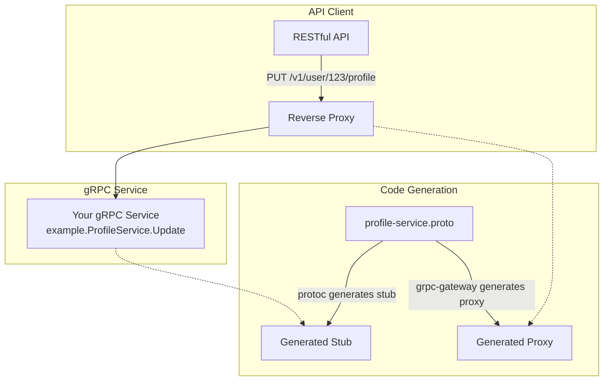

# Service gRPC-Gateway

New services should use gRPC for inter-service communication, by defining protobufs it defines the structures used by gRPC, this can also be reutilized for REST, by "translating" protobuf into json, [grpc-gateway](https://github.com/grpc-ecosystem/grpc-gateway) provides this funcitonality, the following diagram represents what grpc-gateway performs.



## Overview

This is a service which is based on REST/gRPC for the Sanservices Golang microservice template.


# ***Requirements***


**Before even beginning to use the template you must install the following tools:**


# Protobuffers
- [protobuf](https://protobuf.dev/getting-started/gotutorial/)
   ``` 
      brew install protobuf
   ```
- [buf](https://github.com/bufbuild/buf) ***protobuf manager***
   ``` 
      brew install buf
   ```


### Docker

The easiest way to run this application is to build a docker image from it and run that image as a container. This would
handle everything from compiling the executable to generating the swagger documentation without much need to know how
any of that works.

To do that run

```
docker build -t {{ cookiecutter.module_name }}-service:latest .
```

and then

```
docker run --name {{ cookiecutter.module_name }}-service -p 8080:8080 {{ cookiecutter.module_name }}-service:latest
```

in the project's root directory.

The downside to using this method of compiling and executing the app is that it makes debugging a little more
complicated. If you're using VSCode for development, you can find information on how to get that right over here

- https://code.visualstudio.com/docs/containers/debug-common.

### Non-Docker setup

The non-docker method of compiling and running this project involves having to run a few commands to test/compile the
code as well as generate swagger documentation. Usually you would have to run these commands sequentially in your
terminal, but we've built in a shortcut with the help of a tool called `modd`.

Not only does modd save us from having to constantly enter a handful of commands every time we'd like to re-compile and
run our project, it also serves as a hot reloader. So (in most cases) it will re-compile and serve your code changes on
the fly, without you having to stop and start things up again.

If you feel the project compilation and startup could use some tweaking, you would need to make those changes
in `${projectRoot}/modd.conf`. Just make sure that, if ever you have to do this, you __make those same changes to the
Dockerfile__ also, or what you have in developement won't match the other dockerised environments (test/staging/prod).

#### Setup steps:

1. Install modd: https://github.com/cortesi/modd.git
2. Install go-statik: https://github.com/rakyll/statik.git
3. Install go-swagger: https://github.com/go-swagger/go-swagger.git
4. In `${projectRoot}/settings`, create a `settings.yml` and `settings_test.yml`, both containing the following:

   ```
   service:
   name: "{{ cookiecutter.module_name }}"
   path_prefix: ""
   version: "1"
   debug: true
   port: 8080
   cache:
   enabled: true
   username: ""
   password: ""
   host: "localhost"
   port: 6379
   database:
   engine: "inmemory"
   host: ""
   name: ""
   port: 3306
   user: ""
   password: ""
   ```
5. Run the app by simply running the command:

   ```
   modd
   ```

   To run the app without modd pre-compiling and hot reloading, run:

   ```
   go run main.go
   ```

   To generate swagger docs without modd or docker:

   ```
   swagger generate spec -w ./internal/api/v1 -o ./files/swaggerui/v1/swagger.yml --scan-models
   statik -dest internal/api/v1/docs -p swagger -src=./files/swaggerui/v1 -f
   ```
6. Try out some of the test endpoints

   Download an API client like Postman (https://www.postman.com/downloads/) to be able to test the project API.

   Try the health check endpoint (GET localhost:8080/healthcheck).

## Project architecture

`/settings`

*️ This is where everything related to project configuration and settings is kept. Settings can be read from yaml files
and can be stored in the same package.

`/files`

*️ Files holds all static files to be served. This includes the generated swagger documentation.

`/internal`

*️ This is the main package of our project where everything specifically related to its domain and functionality lives.

`/internal/api`

*️ This package contains everything related to the service api - router, routes, handlers, middleware(filters) etc.

`/internal/api/${versionNumber}/swagger`

*️ Holds generated go-statik file (the swagger docs binary that is generated - no need to touch this file ever).

`/internal/{{ cookiecutter.module_name }}`

*️ This package contains all business logic and data repository interaction for {{ cookiecutter.module_name }} domain.

`/internal/{{ cookiecutter.module_name }}/entity`

*️ This package contains structs matching the raw data fetched from each repository. This data will then might be
transformed and enriched in the api layer before it is emitted.

`/internal/{{ cookiecutter.module_name }}/{{ cookiecutter.module_name }}.go`

*️ This file serves as the contract (interface) for functionality in the packages within, namely repository and service.

`/internal/{{ cookiecutter.module_name }}/repository`

*️ This package contains all implementations of the `Repository` interface declared
in `/internal/{{ cookiecutter.module_name }}/{{ cookiecutter.module_name }}.go`.

`/internal/{{ cookiecutter.module_name }}/service`

*️ This package contains all business logic. It is responsible for data transformation/enrichment and choosing where to
fetch necessary data from
