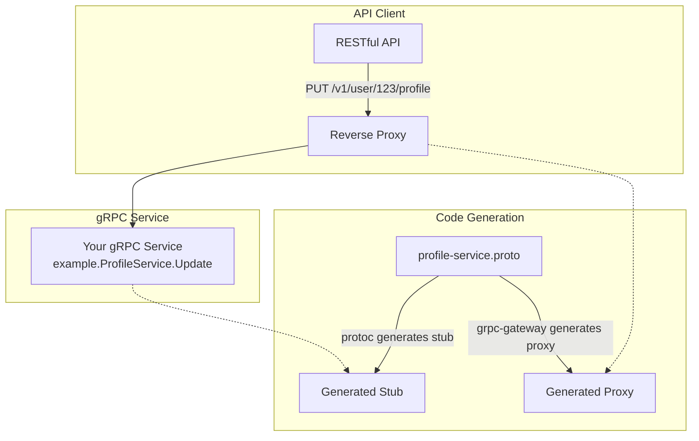

# Service gRPC-Gateway

New services should use gRPC for inter-service communication, by defining protobufs it defines the structures used by gRPC, this can also be reutilized for REST, by "translating" protobuf into json, [grpc-gateway](https://github.com/grpc-ecosystem/grpc-gateway) provides this functionality, the following diagram represents what grpc-gateway performs.


```mermaid
graph TD
    subgraph "API Client"
        RESTAPI[RESTful API]
        RESTAPI -->|PUT /v1/user/123/profile| ReverseProxy
    end

    subgraph "gRPC Service"
        ReverseProxy[Reverse Proxy] --> gRPCService[Your gRPC Service<br>example.ProfileService.Update]
    end

    subgraph "Code Generation"
        proto[profile-service.proto] -->|protoc generates stub| Stub[Generated Stub]
        proto -->|grpc-gateway generates proxy| Proxy[Generated Proxy]
    end

    ReverseProxy -.-> Proxy
    gRPCService -.-> Stub
```

## Overview

This is a service which is based on REST/gRPC for the Sanservices Golang microservice template.


# ***Requirements***


**Before even beginning to use the template you must install the following tools:**


# Protobuffers
- [protobuf](https://protobuf.dev/getting-started/gotutorial/)
   ``` 
      brew install protobuf
   ```
- [buf](https://github.com/bufbuild/buf) ***protobuf manager***
   ``` 
      brew install buf
   ```


### Docker

The easiest way to run this application is to build a docker image from it and run that image as a container. This would
handle everything from compiling the executable to generating the swagger documentation without much need to know how
any of that works.

To do that run

```
docker build -t {{ cookiecutter.module_name }}-service:latest .
```

and then

```
docker run --name {{ cookiecutter.module_name }}-service -p 8080:8080 {{ cookiecutter.module_name }}-service:latest
```

in the project's root directory.

The downside to using this method of compiling and executing the app is that it makes debugging a little more
complicated. If you're using VSCode for development, you can find information on how to get that right over here

- https://code.visualstudio.com/docs/containers/debug-common.

### Non-Docker setup

The project ships with a `Makefile` and a `settings.yml` pre-filled with sensible
local defaults. Make sure the protobuf toolchain (`protobuf` + `buf`) is installed
(see the requirements above) before generating code.

#### Setup steps:

1. Review `settings.yml` and adjust it for your environment (REST/gRPC ports,
   database, cache, ...). The config file path can be overridden at runtime with the
   `SETTINGS_PATH` environment variable.

2. (Re)generate the protobuf / gRPC / gateway / OpenAPI code whenever you change a
   `.proto` file:

   ```
   make generate
   ```

3. Use the `Makefile` for the common tasks (run `make help` to list them all):

   ```
   make run     # run the service locally (go run .)
   make build   # build the binary
   make test    # run the test suite
   make lint    # run golangci-lint
   make tidy    # sync go.mod / go.sum with the source
   ```

   Or run it directly without make:

   ```
   go run .
   ```

4. Try out the endpoints. The service exposes a health check at
   `GET localhost:8080/healthcheck` and gRPC on port `50051`. Use an API client such
   as [Postman](https://www.postman.com/downloads/) to exercise the rest of the API.

## Project architecture

`settings.yml`

*️ Service configuration (REST + gRPC), read at startup and mapped onto typed structs by the `config` package. The file
path can be overridden with the `SETTINGS_PATH` environment variable.

`buf.yaml` / `buf.gen.yaml`

*️ Buf configuration driving protobuf, gRPC, grpc-gateway and OpenAPI code generation (`make generate`).

`/internal/api/proto`

*️ The `.proto` service/message definitions — the single source of truth for the gRPC and REST (gateway) surfaces.

`/internal`

*️ The main package of the project, where everything specific to its domain and functionality lives.

`/internal/api`

*️ Everything related to the service API — router, routes, handlers, middleware (filters), etc.

`/internal/api/v1/swagger`

*️ The embedded swagger UI assets, served by the docs handler via `//go:embed`.

`/internal/{{ cookiecutter.service_name }}`

*️ All business logic and data-repository interaction for the {{ cookiecutter.service_name }} domain.

`/internal/{{ cookiecutter.service_name }}/entity`

*️ Structs matching the raw data fetched from each repository, before it is transformed/enriched in the API layer.

`/internal/{{ cookiecutter.service_name }}/{{ cookiecutter.service_name }}.go`

*️ The domain contract — the `Service`, `Repository` (and optional `Cache`) interfaces implemented by the packages within.

`/internal/{{ cookiecutter.service_name }}/repository`

*️ Implementations of the `Repository` interface, one sub-package per backend (mysql/oracle/sqlite/redis).

`/internal/{{ cookiecutter.service_name }}/service`

*️ The business logic: responsible for data transformation/enrichment and choosing where to fetch data from.
