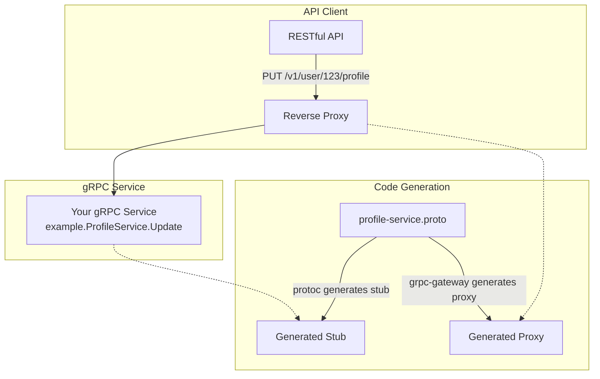

# Service gRPC-Gateway + MCP

This template builds a service that exposes the **same business logic over three surfaces at once**:

- **gRPC** — for inter-service communication, defined by protobufs.
- **REST** — generated from the same protobufs via [grpc-gateway](https://github.com/grpc-ecosystem/grpc-gateway) ("translating" protobuf into JSON).
- **MCP** ([Model Context Protocol](https://modelcontextprotocol.io)) — so LLM agents can call the service operations as tools.

All three are thin adapters in front of the shared `internal/{{ cookiecutter.service_name }}/service` layer. gRPC and REST are backed by the generated protobuf handlers; MCP is served separately from `internal/mcp` and registers each service operation as an MCP tool.

By defining protobufs it defines the structures used by gRPC, this can also be reutilized for REST, by "translating" protobuf into json, [grpc-gateway](https://github.com/grpc-ecosystem/grpc-gateway) provides this functionality, the following diagram represents what grpc-gateway performs.



## Overview

This is a service which is based on REST/gRPC/MCP for the Sanservices Golang microservice template.

By default the three surfaces listen on separate ports (configurable in `settings.yml`):

| Surface | Default port | Notes |
|---------|--------------|-------|
| REST (grpc-gateway) + healthcheck | `8080` (`Service.port`) | Swagger at `http://localhost:8080/v1/docs` |
| gRPC | `50051` (`GRPC.port`) | Reflection enabled |
| MCP | `8081` (`MCP.port`) | Streamable HTTP transport at `http://localhost:8081` |

You can point any MCP client (e.g. Claude, an MCP Inspector, or the Go SDK client) at the MCP port to discover and call the registered tools.


# ***Requirements***


**Before even beginning to use the template you must install the following tools:**


# Protobuffers
- [protobuf](https://protobuf.dev/getting-started/gotutorial/)
   ``` 
      brew install protobuf
   ```
- [buf](https://github.com/bufbuild/buf) ***protobuf manager***
   ``` 
      brew install buf
   ```


### Docker

The easiest way to run this service is to build and run its container image. The multi-stage `Dockerfile` compiles the
binary and packages it into a small, non-root [distroless](https://github.com/GoogleContainerTools/distroless) image
together with its default `settings.yml`.

```
make docker-build   # docker build -t {{ cookiecutter.root_directory_name }}:latest .
make docker-run     # run the image and publish the service port(s)
```

Or directly:

```
docker build -t {{ cookiecutter.root_directory_name }}:latest .
docker run --rm -p 8080:8080 -p 50051:50051 -p 8081:8081 {{ cookiecutter.root_directory_name }}:latest
```

The downside to using this method of compiling and executing the app is that it makes debugging a little more
complicated. If you're using VSCode for development, you can find information on how to get that right over here

- https://code.visualstudio.com/docs/containers/debug-common.

### Non-Docker setup

The project ships with a `Makefile` and a `settings.yml` pre-filled with sensible
local defaults. Make sure the protobuf toolchain (`protobuf` + `buf`) is installed
(see the requirements above) before generating code.

#### Setup steps:

1. Review `settings.yml` and adjust it for your environment (REST/gRPC/MCP ports,
   database, cache, ...). The config file path can be overridden at runtime with the
   `SETTINGS_PATH` environment variable.

2. (Re)generate the protobuf / gRPC / gateway / OpenAPI code whenever you change a
   `.proto` file:

   ```
   make generate
   ```

3. Use the `Makefile` for the common tasks (run `make help` to list them all):

   ```
   make run     # run the service locally (go run .)
   make build   # build the binary
   make test    # run the test suite
   make lint    # run golangci-lint
   make tidy    # sync go.mod / go.sum with the source
   ```

   Or run it directly without make:

   ```
   go run .
   ```

4. Try out the endpoints. The service exposes a health check at
   `GET localhost:8080/healthcheck` and gRPC on port `50051`, plus the MCP server on
   port `8081`. Use an API client such as
   [Postman](https://www.postman.com/downloads/) to exercise the rest of the API.

## Observability

The service emits [Datadog](https://docs.datadoghq.com/tracing/) APM traces out of the box. The tracer is started at
boot with the service name and version from `settings.yml`, and incoming HTTP (REST/gateway) requests are traced
automatically via Datadog's echo middleware. Configure it through the standard Datadog environment variables — no code
changes required:

| Variable | Purpose | Default |
|----------|---------|---------|
| `DD_ENV` | Deployment environment (e.g. `prod`, `staging`) | _(unset)_ |
| `DD_SERVICE` | Service name override | `Service.name` from `settings.yml` |
| `DD_VERSION` | Service version override | `Service.version` from `settings.yml` |
| `DD_AGENT_HOST` | Datadog agent host | `localhost` |
| `DD_TRACE_AGENT_PORT` | Datadog agent trace port | `8126` |

If no Datadog agent is reachable the tracer simply no-ops, so it is safe to leave enabled in local development.

## Project architecture

`settings.yml`

*️ Service configuration (REST + gRPC + MCP), read at startup and mapped onto typed structs by the `config`
package. The file path can be overridden with the `SETTINGS_PATH` environment variable.

`buf.yaml` / `buf.gen.yaml`

*️ Buf configuration driving protobuf, gRPC, grpc-gateway and OpenAPI code generation (`make generate`).

`/internal/api/proto`

*️ The `.proto` service/message definitions — the single source of truth for the gRPC and REST (gateway) surfaces.

`/internal`

*️ The main package of the project, where everything specific to its domain and functionality lives.

`/internal/api`

*️ Everything related to the service API — router, routes, handlers, middleware (filters), etc.

`/internal/api/v1/swagger`

*️ The embedded swagger UI assets, served by the docs handler via `//go:embed`.


`/internal/mcp`

*️ Exposes the service over the Model Context Protocol. `mcp.go` builds the MCP server and serves it over Streamable HTTP; `tools.go` registers each service operation as an MCP tool. Tool handlers delegate to the same `service` layer used by the gRPC/REST handlers, so behaviour stays consistent. Add new tools in `registerTools`.


`/internal/{{ cookiecutter.service_name }}`

*️ All business logic and data-repository interaction for the {{ cookiecutter.service_name }} domain.

`/internal/{{ cookiecutter.service_name }}/entity`

*️ Structs matching the raw data fetched from each repository, before it is transformed/enriched in the API layer.

`/internal/{{ cookiecutter.service_name }}/{{ cookiecutter.service_name }}.go`

*️ The domain contract — the `Service`, `Repository` (and optional `Cache`) interfaces implemented by the packages within.

`/internal/{{ cookiecutter.service_name }}/repository`

*️ Implementations of the `Repository` interface, one sub-package per backend (mysql/oracle/sqlite/redis).

`/internal/{{ cookiecutter.service_name }}/service`

*️ The business logic: responsible for data transformation/enrichment and choosing where to fetch data from.
